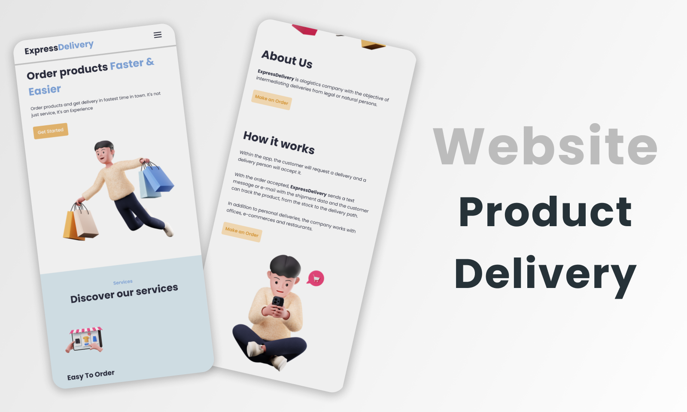
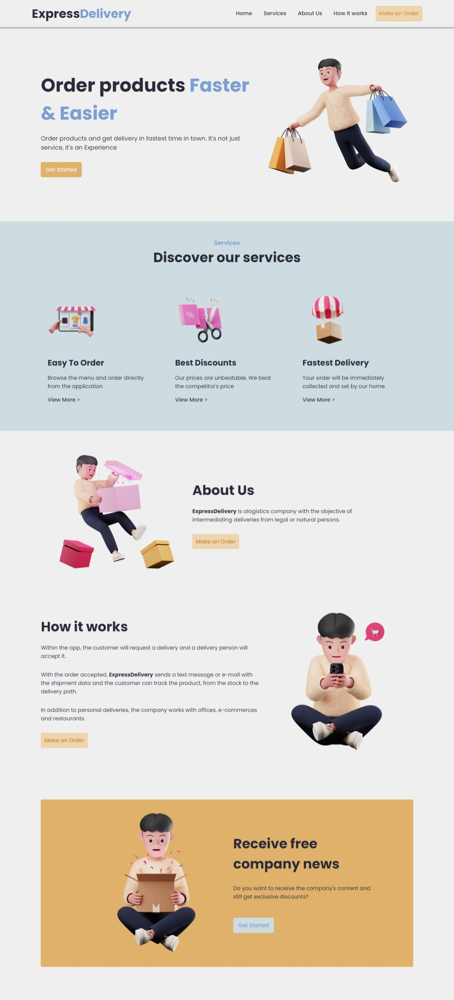

<h1 align="center">📦 ExpressDelivery</h1>

  <strong>Site de produtos de entrega</strong>

  

  

### Site 💻

- [ExpressDelivery](https://deliveryexpress.netlify.app/)

## Linguagens: 🚀
- HTML
- CSS
- JavaScript

## Referências: ⌨️

- [Dribbble](https://dribbble.com/)
- [Figma Community](https://www.figma.com/community/explore)
- [Iconscout](https://iconscout.com/)
